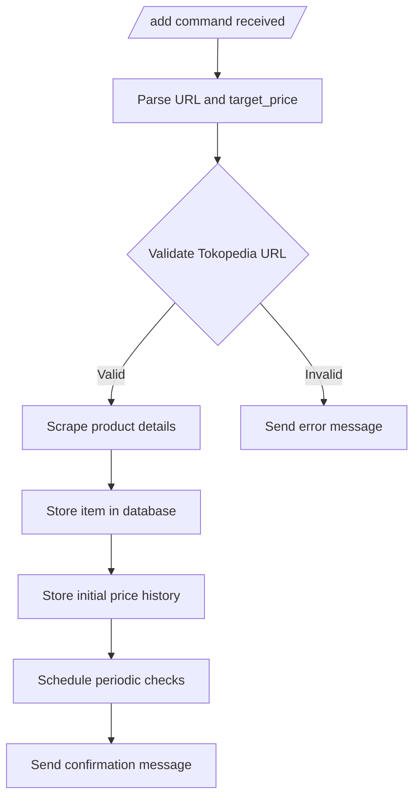

# Add Feature Implementation Plan

## Objective

Implement the `/add` command for the ThriftMind Telegram bot, allowing users to track items from Tokopedia and receive price drop notifications.

## Workflow Diagram



## Implementation Steps

### 1. Command Handler (src/index.ts)

- Register new command: `bot.command('add', ...)`
- Parse arguments:
  ```ts
  const url = ctx.match.split(' ')[0];
  const targetPrice = parseFloat(ctx.match.split(' ')[1]);
  ```
- Validate user exists in database
- Validate URL format (Tokopedia pattern: `https?://(www\.)?tokopedia\.com/.*`)

### 2. Scraper Module (src/scrapers/tokopedia.ts)

```ts
export async function scrapeTokopedia(url: string) {
	const response = await fetch(url);
	const html = await response.text();
	// Cheerio implementation
	const $ = cheerio.load(html);

	return {
		title: $('h1[data-testid="lblPDPDetailProductName"]').text().trim(),
		price: parseFloat(
			$('div[data-testid="lblPDPDetailProductPrice"]')
				.text()
				.replace(/[^\d,]/g, '')
				.replace(',', '.')
		),
		currency: 'IDR',
	};
}
```

### 3. Database Operations

- Insert new item into `items` table:
  ```ts
  await ctx.db.insert(items).values({
  	id: generateId(),
  	url,
  	title: product.title,
  	currentPrice: product.price,
  	targetPrice,
  	userId: ctx.from.id.toString(),
  	lastChecked: new Date(),
  });
  ```
- Create initial price history entry

### 4. Configuration (wrangler.toml)

Add cron trigger for daily price checks:

```toml
[triggers]
crons = ["0 8 * * *"]  # Run daily at 8am UTC
```

### 5. Error Handling

- Specific error messages:
  - "Invalid Tokopedia URL"
  - "Product not found"
  - "Price extraction failed"
- Log detailed errors to console

### 6. Confirmation Message

```ts
await ctx.reply(`✅ Added tracking for:
${product.title}
Current Price: ${formatCurrency(product.price, product.currency)}
${targetPrice ? `Target Price: ${formatCurrency(targetPrice, product.currency)}` : ''}`);
```

## Future Enhancements

1. Add support for Shopee and other marketplaces
2. Implement price tracking for multiple variants
3. Add image thumbnails to item listings
4. Implement price drop prediction
5. Add affiliate link generation
