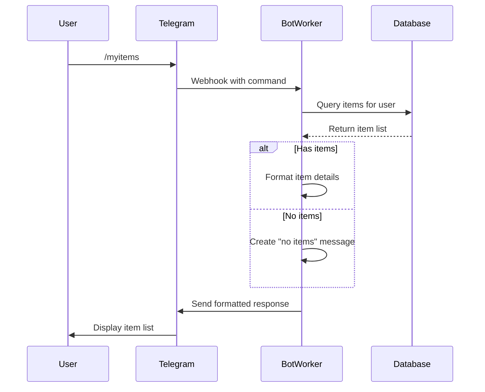

# Implementation Plan: `/myitems` Command

## Objective

Implement a Telegram bot command that lists all items currently being tracked by the user, showing current price and last checked date.

## Implementation Steps

### 1. Create Command Handler

Location: `src/index.ts`

- Add handler function `handleMyItemsCommand`
- Query database for user's items
- Format response with item details

### 2. Database Query

```typescript
const userId = ctx.from?.id.toString();
const userItems = await db.select().from(items).where(eq(items.userId, userId)).all();
```

### 3. Response Formatting

Format each item as:

```
📌 [Title]
💰 Current Price: Rp [currentPrice]
🎯 Target Price: Rp [targetPrice] (if set)
⏰ Last Checked: [formatted date]
```

### 4. Error Handling

- Handle case where user has no items
- Handle database errors

### 5. Date Formatting Helper

```typescript
function formatDate(timestamp: number): string {
	return new Date(timestamp).toLocaleDateString();
}
```

### 6. Bot Integration

Add to command setup:

```typescript
bot.command('myitems', (ctx) => handleMyItemsCommand(ctx, db));
```

### Sequence Diagram



## Next Steps

Switch to Code mode to implement the solution.
