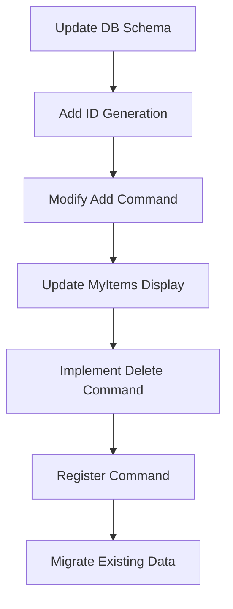

# Delete Command Implementation Plan

## Objective

Implement item deletion functionality using short IDs:

1. Add short IDs to tracked items
2. Create `/delete` command

## Phases

### 1. Database Schema Update

- Add `short_id` column to items table
- Unique constraint to prevent conflicts

```typescript[src/db/schema.ts]
export const items = sqliteTable(
  'items',
  {
    // ... existing columns
    shortId: text('short_id').notNull().unique(), // Add this column
  },
);
```

### 2. Short ID Generation

- Create utility function (4-char alphanumeric)
- Ensure uniqueness check

```typescript[src/utils/idGenerator.ts]
export function generateShortId(length = 4): string {
  const chars = 'ABCDEFGHIJKLMNOPQRSTUVWXYZ0123456789';
  let result = '';
  for (let i = 0; i < length; i++) {
    result += chars.charAt(Math.floor(Math.random() * chars.length));
  }
  return result;
}
```

### 3. Update Item Creation

- Generate short ID when adding new items

```typescript[src/handlers/items.ts]
// In handleAddCommand
const shortId = generateShortId();
await db.insert(items).values({
  // ... other values
  shortId, // Add short ID
});
```

### 4. Update MyItems Command

- Display short IDs in item listings

```typescript[src/handlers/items.ts]
// In handleMyItemsCommand
message += `\n\n🆔 ${item.shortId} - 📌 ${truncate(item.title)}`;
```

### 5. Implement Delete Command

- Create handler for `/delete <short-id>`

```typescript[src/handlers/items.ts]
export async function handleDeleteCommand(ctx, db) {
  const shortId = ctx.match.trim();
  // Delete item by short ID and user ID
}
```

### 6. Register Command

- Add to main bot setup

```typescript[src/index.ts]
bot.command('delete', (ctx) => handleDeleteCommand(ctx, db));
```

### 7. Data Migration (Optional)

- Script to add short IDs to existing items

```typescript[scripts/migrate-short-ids.ts]
// Generate short IDs for all existing items
```

## Implementation Sequence



## Open Questions

1. Should short IDs be case-sensitive? (Recommend: case-insensitive)
2. Optimal ID length? (Recommend: 4 characters = 1.6M combinations)
3. Migrate existing items? (Recommend: yes)
