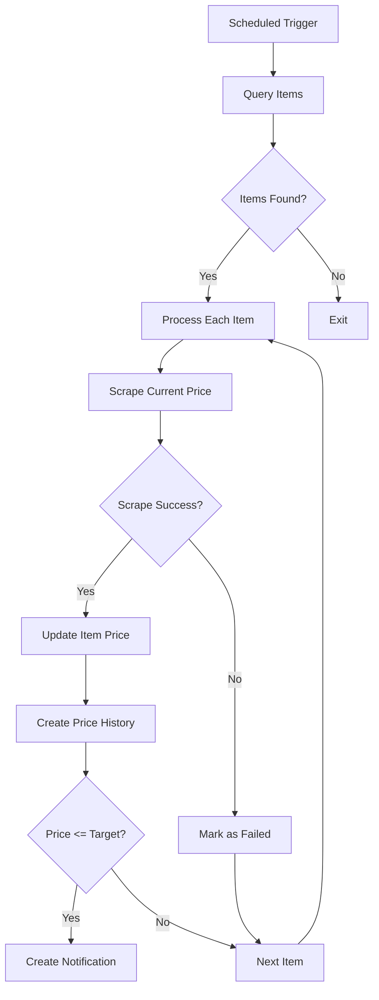

# Scheduled Item Processing Implementation Plan

## Processing Flow



## Implementation Details

### 1. Query Items

```typescript
const BATCH_SIZE = 10; // Process 10 items per scheduled run

const itemsToProcess = await db
	.select()
	.from(items)
	.orderBy(asc(items.lastChecked)) // Process oldest first
	.limit(BATCH_SIZE);
```

### 2. Scraping Process

```typescript
// src/utils/scraperUtils.ts
export async function scrapeItemPrice(url: string): Promise<number> {
	// Implementation using cheerio or similar
	// Returns current price
}
```

### 3. Update Item and History

```typescript
await db.transaction(async (tx) => {
	// Update item
	await tx
		.update(items)
		.set({
			currentPrice: newPrice,
			lastChecked: new Date(),
		})
		.where(eq(items.id, item.id));

	// Create price history
	await tx.insert(priceHistory).values({
		id: generateId(),
		itemId: item.id,
		price: newPrice,
		recordedAt: new Date(),
	});
});
```

### 4. Notification Check

```typescript
if (item.targetPrice && newPrice <= item.targetPrice) {
	// src/services/notificationService.ts
	await createNotification(item.userId, item, newPrice);
}
```

### 5. Error Handling

```typescript
try {
	// scraping and update logic
} catch (error) {
	console.error(`Failed to process item ${item.id}:`, error);
	// Update error count or last error message
	await db
		.update(items)
		.set({ errorCount: increment(1) })
		.where(eq(items.id, item.id));
}
```

## Proposed File Structure Changes

1. **scheduled.ts** - Main handler (`src/handlers/scheduled.ts`)
2. **scraperUtils.ts** - Shared scraping functions (`src/utils/scraperUtils.ts`)
3. **notificationService.ts** - Notification logic (`src/services/notificationService.ts`)

## Open Questions

1. Batch size per run (default: 10 items)
2. Handling of repeatedly failing items (error threshold?)
3. Retry mechanism for failed scrapes
4. Notification delivery method (Telegram, email, etc.)

## Next Steps

Switch to Code mode to implement this solution.
