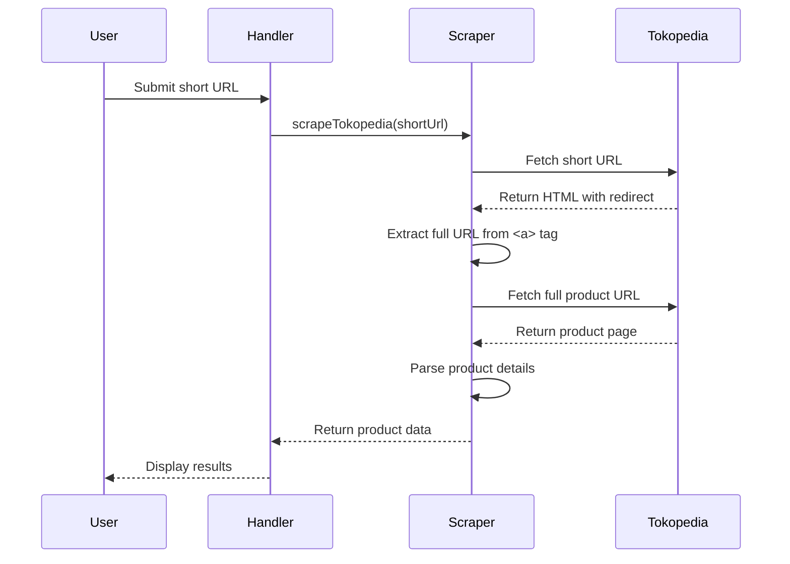

# Tokopedia Short URL Handling Plan

## Background

The current scraper only handles full Tokopedia product URLs. We need to support short URLs (e.g., `https://tk.tokopedia.com/ZSkePH4he/`) by:

1. Detecting short URLs
2. Resolving them to full product URLs
3. Passing the full URL to the existing scraper

## Implementation Plan

### 1. Short URL Detection

```ts
const TOKOPEDIA_SHORT_URL_REGEX = /^https?:\/\/tk\.tokopedia\.com\/[^/]+/i;
```

### 2. URL Resolution Function

```ts
async function resolveShortUrl(shortUrl: string): Promise<string> {
	const response = await fetch(shortUrl, {
		headers: { 'User-Agent': randomizeUserAgent() },
		redirect: 'manual', // Important to prevent automatic redirects
	});

	const html = await response.text();
	const $ = cheerio.load(html);
	const fullUrl = $('a').attr('href');

	if (!fullUrl) throw new ScrapingError('No redirect URL found', shortUrl);
	return fullUrl;
}
```

### 3. Updated Scrape Function

```ts
export async function scrapeTokopedia(url: string): Promise<ScrapedProduct> {
	// Resolve short URLs
	if (TOKOPEDIA_SHORT_URL_REGEX.test(url)) {
		url = await resolveShortUrl(url);
	}

	if (!isValidTokopediaUrl(url)) {
		throw new ScrapingError('Invalid URL format', url);
	}

	// Existing scraping logic continues here...
}
```

### 4. Sequence Flow



## Testing Plan

1. Unit tests for:
   - Short URL detection regex
   - URL resolution function
   - Full scraping flow with short URLs
2. Integration tests with mock servers

## Next Steps

1. Implement code changes in `src/scrapers/tokopedia.ts`
2. Add unit tests
3. Update handler in `src/handlers/items.ts` to handle short URLs
