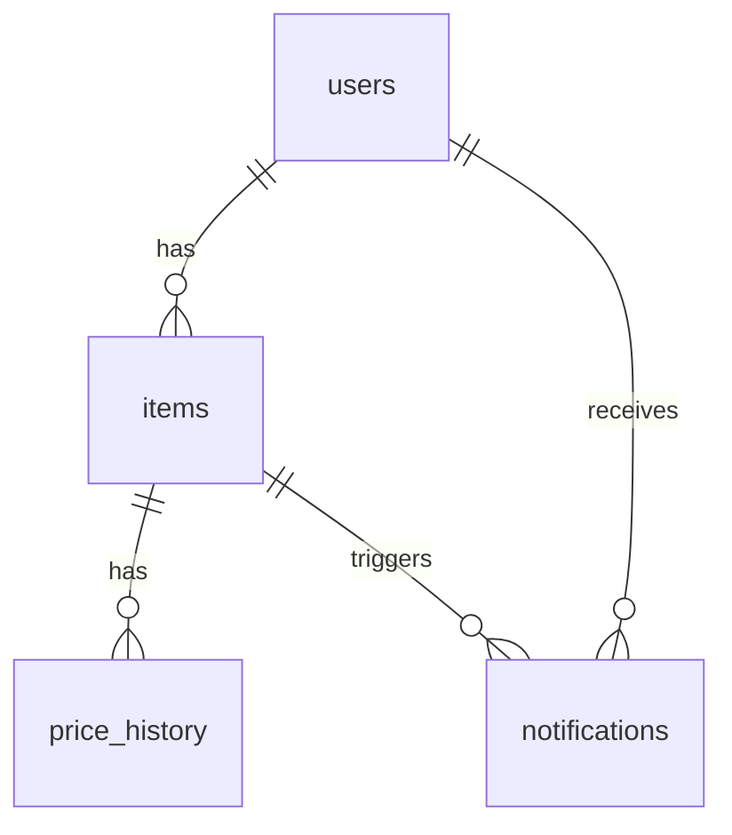

# ThriftMind Database Schema

## Tables

### `users`

Stores Telegram user information.

| Column     | Type           | Description                    |
| ---------- | -------------- | ------------------------------ |
| id         | string         | Primary key (Telegram user ID) |
| username   | string         | Telegram username              |
| first_name | string         | User's first name              |
| last_name  | string \| null | User's last name (optional)    |
| created_at | timestamp      | Account creation timestamp     |

### `items`

Tracks products being monitored.

| Column        | Type           | Description                              |
| ------------- | -------------- | ---------------------------------------- |
| id            | string         | Primary key                              |
| url           | string         | Unique item URL                          |
| title         | string         | Product title                            |
| current_price | number         | Current price of the item                |
| target_price  | number \| null | Target price for notification (optional) |
| last_checked  | timestamp      | Last time the price was checked          |
| user_id       | string         | Foreign key to `users.id`                |

### `price_history`

Historical price data for items.

| Column      | Type      | Description                |
| ----------- | --------- | -------------------------- |
| id          | string    | Primary key                |
| item_id     | string    | Foreign key to `items.id`  |
| price       | number    | Price at the recorded time |
| recorded_at | timestamp | Timestamp of the record    |

### `notifications`

Notification records sent to users.

| Column    | Type      | Description               |
| --------- | --------- | ------------------------- |
| id        | string    | Primary key               |
| user_id   | string    | Foreign key to `users.id` |
| item_id   | string    | Foreign key to `items.id` |
| old_price | number    | Price before the drop     |
| new_price | number    | Price after the drop      |
| sent_at   | timestamp | Timestamp of notification |

## Entity Relationships

## Implementation Notes

1. Schema file location: `src/db/schema.ts`
2. Uses Drizzle ORM with SQLite dialect
3. Database hosted on Cloudflare D1
